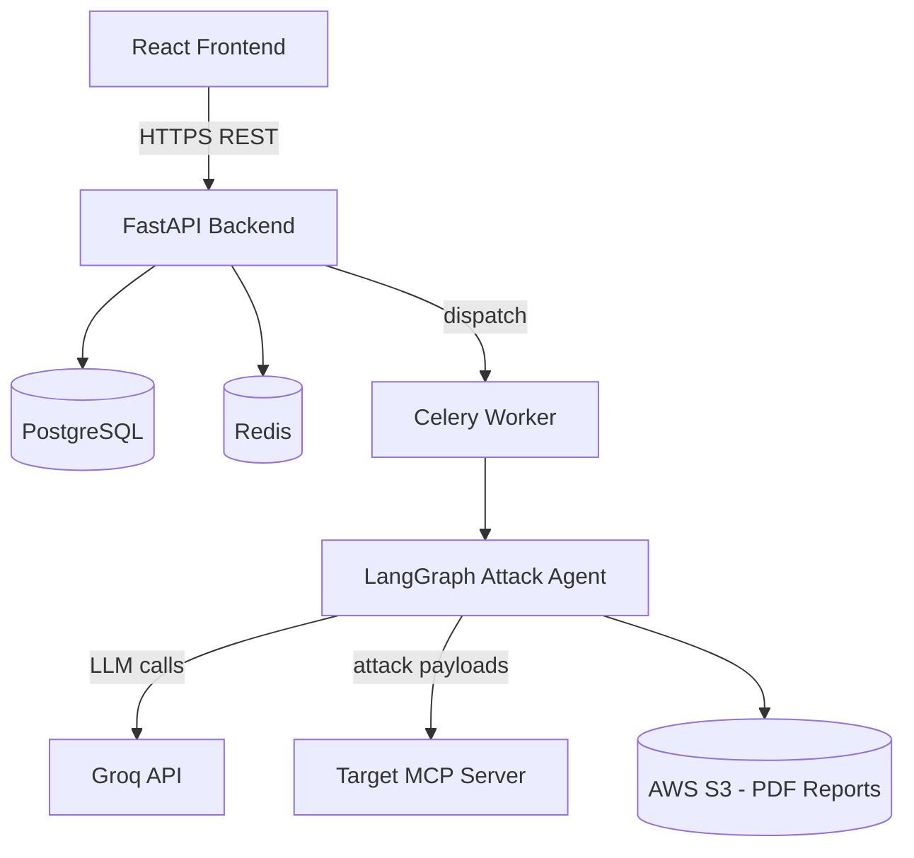
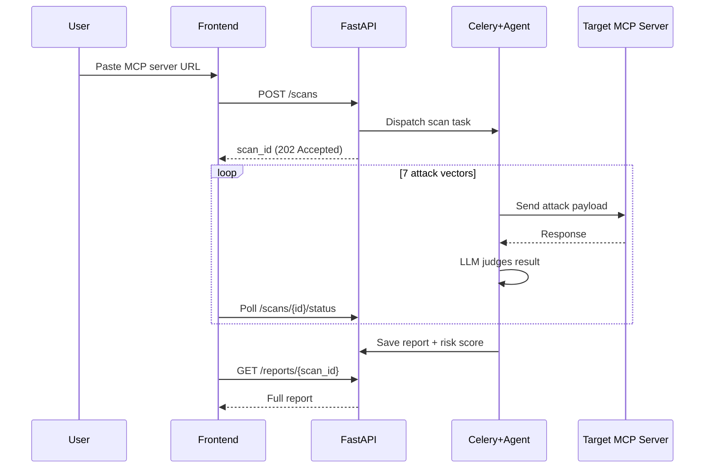

# MCP Shield

AI-powered security scanner for MCP servers. Tests against the OWASP MCP Top 10 — prompt injection, tool poisoning, SSRF, and more — using a LangGraph attack agent.

[](https://www.python.org/)
[](https://fastapi.tiangolo.com/)
[](https://react.dev/)
[](LICENSE)
[](#)

## What is this?

Model Context Protocol (MCP) has seen explosive adoption with over **97 million monthly SDK downloads** as of early 2026. However, this rapid integration has introduced severe security challenges, with **over 30+ CVEs published in January and February 2026 alone**. Notably, **43% of these CVEs involve shell injection and remote code execution (RCE) vulnerabilities**.

**MCP Shield** is an automated, full-stack security scanning platform designed specifically to audit MCP servers. It utilizes an autonomous **LangGraph attack agent** powered by state-of-the-art LLMs (via Groq) to simulate exploit payloads mapping directly to the OWASP MCP Top 10 security guidelines. By testing exposed endpoints, checking boundaries, and assessing isolation mechanisms, MCP Shield exposes severe vulnerabilities before they hit production, providing developer-focused PDF remediation reports.

---

## Demo

*Live demo coming soon — see [Local Setup](#local-setup) below to run it yourself.*

<!-- Screenshot coming soon: dashboard.png -->
<!-- Screenshot coming soon: report.png -->

---

## How It Works

MCP Shield uses a distributed worker model to run comprehensive security scans. A scan is initialized on the React frontend, dispatched through a FastAPI backend, and executed by a Celery task queue utilizing an intelligent LangGraph agent state machine.

### System Architecture

```
                                  +-------------------+
                                  |  React Frontend   |
                                  +---------+---------+
                                            |
                                            | HTTPS REST
                                            v
                                  +---------+---------+
                                  |  FastAPI Backend  |
                                  +----+----+----+----+
                                       |    |    |
                   +-------------------+    |    +-------------------+
                   |                        |                        |
                   v                        v                        v
            +------+------+          +------+------+          +------+------+
            |  PostgreSQL |          |    Redis    |          |   AWS S3    |
            | (User/Scans)|          | (Task Queue)|          | (PDF Reports|
            +-------------+          +------+------+          +-------------+
                                            |
                                            | dispatch
                                            v
                                     +------+------+
                                     |Celery Worker|
                                     +------+------+
                                            |
                                            v
                                  +---------+---------+
                                  | LangGraph Agent   |
                                  +----+----+----+----+
                                       |         |
                          LLM Queries  |         | Attack Payloads
                                       v         v
                                  +----+----+  +----+----+
                                  |  Groq   |  | Target  |
                                  |  API    |  | MCP Svr |
                                  +---------+  +---------+
```



### Scan Lifecycle Flow



1. **Manifest Probe**: The agent queries the target server's `/tools/list` to understand the schema and parameters of all exposed tools.
2. **Exploit Simulation**: The agent dynamically executes 7 individual nodes representing different OWASP attack patterns tailored to the target server's tool parameters.
3. **LLM Evaluation**: Responses from the server are processed by an LLM evaluator node that checks for bypasses, environment exposures, directory traversals, or shell indicators.
4. **Scoring & Reporting**: The agent aggregates the vulnerability findings into a total risk score (0-100), writes a detailed database record, and publishes a PDF report containing remediation steps.

---

## The 7 Attack Vectors

| Attack ID | Name | What It Tests | Severity if Found |
| :--- | :--- | :--- | :--- |
| **A01** | Prompt Injection | Feeds adversarial prompts to see if the server ignores system rules or acts on unauthorized directions. | **High** |
| **A02** | Tool Poisoning | Attempts to pass tainted data to tools to see if it causes execution hijack or compromises server state. | **High** |
| **A03** | Secret Exposure | Checks if tools leak environmental tokens (e.g. AWS access keys, database passwords) in response bodies or errors. | **Critical** |
| **A04** | Shell/Command Injection | Inputs command separators (`&&`, `;`, `\|`) to probe for remote code execution (RCE) inside execution utilities. | **Critical** |
| **A05** | SSRF Boundaries | Directs network tools to fetch local/private IP hosts (e.g., `169.254.169.254`, `127.0.0.1`) to check network isolation. | **High** |
| **A06** | Dynamic Rug Pull | Simulates sudden schema changes or missing tools during a live execution session to see if the agent crashes. | **Medium** |
| **A07** | Supply Chain Check | Evaluates dependency integrity, basic HTTP security headers, and known library vulnerabilities. | **Medium** |

---

## Tech Stack

### Backend
* **FastAPI (0.111.0)**: High-performance ASGI framework for web APIs.
* **SQLAlchemy (2.0.30) & Alembic**: Database ORM and migrations.
* **Celery (5.3.6) & Redis (5.0.4)**: Asynchronous task routing and queueing.
* **ReportLab (4.2.0)**: PDF generation engine for security reports.

### AI / Agent Layer
* **LangGraph (0.2.x)**: Orchestrator framework for stateful, multi-agent flows.
* **LangChain-Groq (0.1.6)**: Light speed LLM invocation client.
* **LLM Engine**: Llama-3-70b/8b (via Groq) for rapid agent execution and judging.

### Frontend
* **React (19.2.6) & Vite**: SPA development server and bundler.
* **TailwindCSS (3.4.0)**: Component styling framework.
* **Zustand (5.0.14)**: Global UI client state management.
* **Recharts (3.8.1)**: Visualization graphs for scan analysis.

---

## Project Structure

```
./
    .gitignore
    docker-compose.yml
    README.md
    backend/
        .env.example
        alembic.ini
        celery_worker.py
        Dockerfile
        requirements.txt
        app/
            config.py
            database.py
            dependencies.py
            main.py
            models.py
            schemas.py
            agent/
                graph.py
                prompts.py
                state.py
                nodes/
                    aggregate_results.py
                    fetch_manifest.py
                    attacks/
                        a01_prompt_injection.py
                        a02_tool_poisoning.py
                        a03_secret_exposure.py
                        a04_shell_injection.py
                        a05_ssrf_check.py
                        a06_rug_pull.py
                        a07_supply_chain.py
            routers/
                auth.py
                reports.py
                scans.py
            services/
                auth_service.py
                pdf_service.py
                report_service.py
                s3_service.py
                scan_service.py
            tasks/
                celery_tasks.py
        migrations/
        tests/
            mock_mcp_server.py
            test_auth.py
            test_reports.py
            test_scans.py
            test_agent/
                test_attacks.py
    frontend/
        .env.example
        .gitignore
        Dockerfile
        eslint.config.js
        index.html
        package.json
        tailwind.config.js
        vite.config.js
        public/
        src/
            App.jsx
            index.css
            main.jsx
            api/
                client.js
            components/
                Navbar.jsx
                RiskScoreBadge.jsx
                ScanTable.jsx
                VulnerabilityCard.jsx
            pages/
                Dashboard.jsx
                Home.jsx
                Login.jsx
                NewScan.jsx
                Report.jsx
                ScanProgress.jsx
```

---

## Local Setup

### Prerequisites
* Docker & Docker Compose
* Node.js 18+ (if running frontend locally outside Docker)
* Python 3.11+ (if running backend locally outside Docker)
* A [Groq API Key](https://console.groq.com) (Free tier works perfectly)
* *Optional*: AWS Access Keys for PDF uploads (SS3) — falls back to local storage if keys are missing.

### Quick Start with Docker
1. **Clone the Repository**
   ```bash
   git clone https://github.com/sumit1kr/MCP-Shield.git
   cd MCP-Shield
   ```
2. **Configure Environment Variables**
   ```bash
   cp backend/.env.example backend/.env
   ```
   Edit `backend/.env` and insert your `GROQ_API_KEY`.
3. **Launch the Container Stack**
   ```bash
   docker-compose up --build
   ```
   * Access the application dashboard at: `http://localhost:5173`
   * Access API documentation (Swagger UI) at: `http://localhost:8000/docs`

### Running Locally (Without Docker)

#### 1. Redis
Ensure Redis is running locally on port `6379`.

#### 2. Backend API & Celery Worker
```bash
cd backend
python -m venv venv
source venv/bin/activate  # On Windows use: venv\Scripts\activate
pip install -r requirements.txt
cp .env.example .env      # Add GROQ_API_KEY inside .env
```
Run migrations:
```bash
alembic upgrade head
```
Start the FastAPI server:
```bash
uvicorn app.main:app --host 127.0.0.1 --port 8000 --reload
```
In a new terminal (with venv activated), run the Celery task worker:
```bash
celery -A celery_worker.celery_app worker --loglevel=info
```

#### 3. Frontend Development Server
```bash
cd frontend
npm install
npm run dev
```
Open `http://localhost:5173` in your browser.

---

## Testing

MCP Shield comes equipped with a comprehensive suite of unit and integration tests.
```bash
cd backend
pytest
```
*Tests mock external APIs and use the self-contained mock server under `tests/mock_mcp_server.py` to evaluate the attack pipelines without issuing outbound requests to real targets.*

---

## API Documentation

Once the backend is running, you can explore the fully interactive OpenAPI docs at `http://localhost:8000/docs`.

### Primary Endpoints
* `/auth/register` & `/auth/login`: JWT-based token authentication.
* `/scans`: POST to trigger a scan, GET to check scan statuses and list user history.
* `/reports/{scan_id}`: Fetch detailed breakdown of security vulnerabilities and public sharing configurations.

---

## Security Considerations

1. **Explicit Permission Required**: Only scan servers that you own or have explicit written permission to test. Simulating exploits can result in server crashes or log noise on remote systems.
2. **SSRF Protections**: Targets are checked against local RFC1918 and loopback address structures by the backend to prevent malicious loopback scanning tricks.
3. **Rate Limiting**: The API applies rate limits (10 scans/day per user account) to prevent excessive billing on your Groq integration.

---

## Roadmap & Known Limitations
* **Transport Modes**: Current version only supports HTTP/S endpoints; support for stdio command-line execution testing of local MCP binaries is planned.
* **Authentication**: Lack of OAuth support for secured target MCP servers (assumes target servers are public or accept api-key headers).
* **Parallel Auditing**: Scan speed is currently bounded by rate limits of the Groq API provider (sequential attack nodes).

---

## Why I Built This
Having contributed to open-source agent tooling and security (including projects like Microsoft RAMPART), I saw a severe tooling gap for validating Model Context Protocol servers. As agents become the primary driver of digital tasks, ensuring the safety of the tools they consume is paramount. MCP Shield was built to make security verification lightweight, automated, and standard.

---

## License
Distributed under the MIT License. See [LICENSE](LICENSE) for more details.

---

## Acknowledgments
* [OWASP Model Context Protocol (MCP) Security Guide](https://owasp.org/)
* [Microsoft RAMPART Project Contributors](https://github.com/microsoft/rampart)
